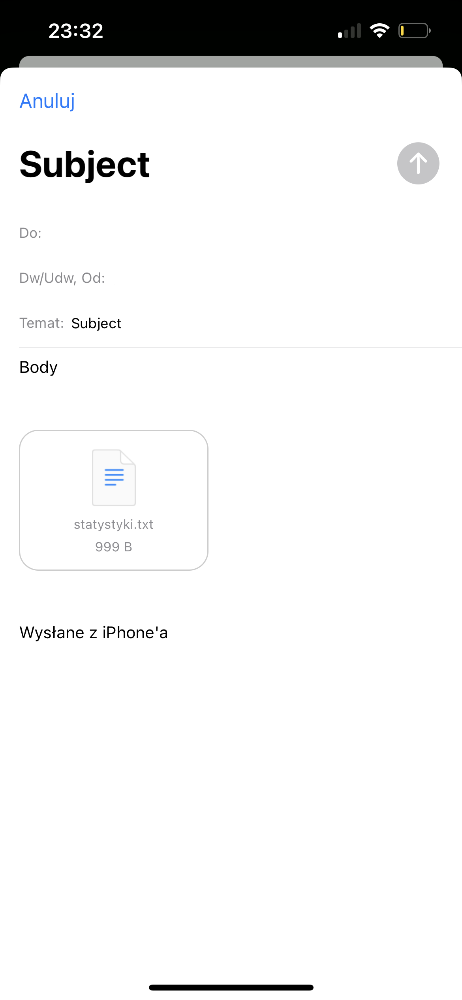

<H1>AudioTestApp</H1>
An application for conducting AB listening tests, collecting data about test participants (gender, age, musical experience), drawing audio samples and saving answers by sending a txt file to the provided e-mail address. Written in the react native framework using the expo-av, expo-file-system, expo-mail-composer libraries.

## Screenshots

After pressing the "zapisz odpowiedzi" button, the answers are saved to the "statystyki.txt" file and sent to the selected email.

Example of answers received in an email file.

## License

[MIT](https://choosealicense.com/licenses/mit/)
